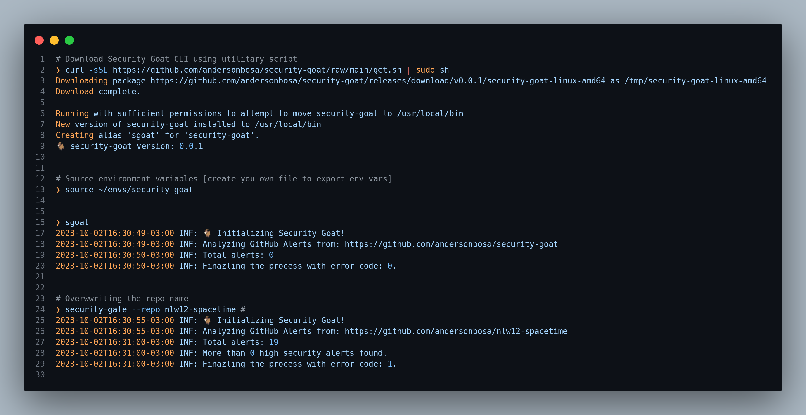

<section align="center">

  

<br>

<p>
  <a href="./security-goat/.version">
    
  </a>
  <a href="./LICENSE">
    
  </a>
  
</p>

<br>

  <!-- badges -->

  <p>
    <a href="#about">About</a> •
    <a href="#technologies">Technologies</a> •
    <a href="#getting-started">Getting Started</a> •
    <a href="#contribution">Contribution</a> •
    <a href="#license">License</a>
  </p>
</section>

---


<h2 id="about">💬 About</h2>

Security-Goat is a command line client to perform [Security Gate](#) written in [Go](#). It interacts with DependaBot alerts using GitHub GraphQL API.

This project enables you to perform a Security Gate on GitHub, utilizing GitHub Actions and your
project's Security Alerts as a foundation of information. Presently, only Dependabot Alerts are supported.

You can establish a vulnerability policy based on the impact, i.e. the number of vulnerabilities
per threat. Finally, your CI/CD pipeline can be automatically blocked if these policies are not met.
This provides enhanced safeguards to your application, thwarting the deployment of code that contains
documented threats to the production environment.



<h2 id="getting-started"> 🚶 Getting Started</h2>

### Installation

You can install the CLI with a `curl` utility script or by downloading the pre-compiled binary from the GitHub release page.
Once installed you'll get the `security-goat` command and `sgoat` alias.

Utility script with `curl`:
```bash
curl -sSL https://github.com/andersonbosa/security-goat/raw/main/get.sh | sudo sh
```

Non-root with curl:
```bash
curl -sSL https://github.com/andersonbosa/security-goat/raw/main/get.sh | sh
```

### Windows
To install the security-goat on Windows go to [Releases](https://github.com/andersonbosa/security-goat/releases) and download the latest `.exe`.

If you want to build it yourself, clone the source files using GitHub, change into the `security-goat` directory and run:
```bash
git clone https://github.com/andersonbosa/security-goat.git
cd security-goat
go install
```

### Usage

#### With envinroment variables

```bash
export GOAT_GITHUB_TOKEN="your_token"
export GOAT_GITHUB_OWNER="your_username"
export GOAT_GITHUB_REPO="your_repository"
export GOAT_SEVERITY_LIMITS_CRITICAL=0
export GOAT_SEVERITY_LIMITS_HIGH=1
export GOAT_SEVERITY_LIMITS_MEDIUM=2
export GOAT_SEVERITY_LIMITS_LOW=10

security-goat --verbose --repo another_repository
```

#### With docker container

```bash
# With Docker Hub Registry:
docker run --rm t4inha/security-goat:latest --help

# Or using Github Container Registry
docker run --rm ghcr.io/andersonbosa/security-goat:latest --help
```

#### CLI

```
Security Gote is a CLI application that allows you to analyze security alerts
and manage security configurations for GitHub repositories. It provides insights
into vulnerabilities and helps you maintain a secure software ecosystem.

For more details and options, you can run 'security-goat --help'.

Usage:
  security-goat [flags]
  security-goat [command]

Available Commands:
  completion  Generate the autocompletion script for the specified shell
  help        Help about any command
  version     Print the version number of the application

Flags:
      --config string   config file (default is $HOME/.security-goat.yaml)
  -C, --critical int    Critical severity limit
      --dryrun          Don't perform security gate
      --error int       Customize exit code to error (default 1)
      --fatal int       Customize exit code to fatal (default 128)
  -h, --help            help for security-goat
  -H, --high int        High severity limit (default 1)
      --insecure        skip TLS verification and use insecure http client
  -L, --low int         Low severity limit (default 5)
  -M, --medium int      Medium severity limit (default 2)
  -o, --owner string    GitHub owner
  -r, --repo string     GitHub repository
      --success int     Customize exit code to success
  -t, --token string    GitHub token
  -v, --verbose         more logs

Use "security-goat [command] --help" for more information about a command.
```

* More details about in [**documentation**](docs/index.md).
* See [examples](https://github.com/andersonbosa/security-goat/blob/main/examples/README.md) to further uses.

<h2 id="distribution"> 🖨️ Distribution</h2>

- Docker image: https://hub.docker.com/r/t4inha/security-goat
- Docker image: https://github.com/andersonbosa/security-goat/pkgs/container/security-goat
- Binaries: https://github.com/andersonbosa/security-goat/releases / [builds](https://github.com/andersonbosa/security-goat/tree/main/build)
- Install utility: https://github.com/andersonbosa/security-goat/blob/main/get.sh

<h2 id="technologies"> 🛠️ Technologies</h2>

* [Go](#)
* [Cobra](#)
* [Viper](#)
* [GitHub GraphQL API](#)
* [Github Container Registry](#)
* [Docker Hub](#)


<h2 id="contribution">🤝 Contribution</h2>

<p>
  This project is for study purposes too, so please send me a message telling me what you are doing and why you are doing it, teach me what you know. All kinds of contributions are very welcome and appreciated!
</p>


<h2 id="license"> 📝 License</h2>

This project is under the MIT license.

This project was inpired by [Securty Gate](https://github.com/instriq/security-gate) from [instriq](https://github.com/instriq) 

---

<h4>  
  
  | Did you like the repository? Give it a star! 😁
</h4>


<!-- Links -->
